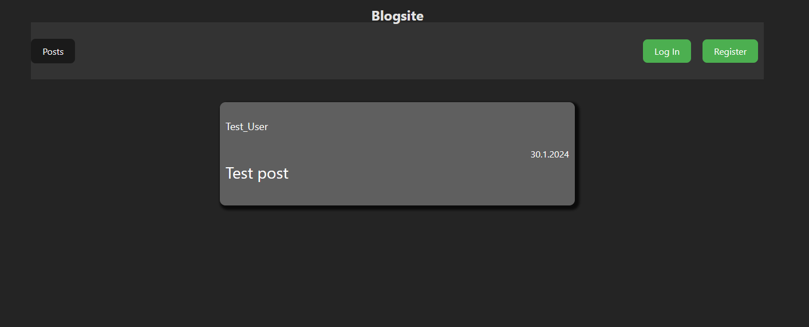

# Blog-Api project from The Odin Project
This project is made while doing the Odin Project. 
It is a simple blog-webpage where you can make an account, log in and make posts and comments to others posts. 
User has a profile page and can add a profile picture. 
Users can delete and edit their posts as well as comments. 
Non-users can see posts but not comment. 

## Express backend, MongoDB database, React frontend
This project uses Express for backend, MongoDB NoSQL database for data storage and React as frontend. 
ESLint is used for finding styling issues and code readability issues. 

## GitHub Actions CI/CD workflow
This project now runs tests when new updates are pushed to repository. 
The test include mostly backend-testing. More tests are to be added for making, updating and deleting posts, comments and users. 
Soon will be added that no updates can be pushed if tests don't pass on the new code. 

## Version: 0.8.1 (21.07.2024)
Added live-version of the site. 

## Version: 0.8 (30.01.2024)
Most of the functionalities done. 
Home page shows all posts sorted by most recently made. 
User can register and login. 
User has profile page with all posts shown by titles. 
User can make, update and delete posts. 
User can make comments to posts.  

All comments are deleted when a post is deleted. 

*Backlog:* 
*Better and more consistent CSS styling* 
*Default profile picture for users and possibility for adding a profile picture*  
